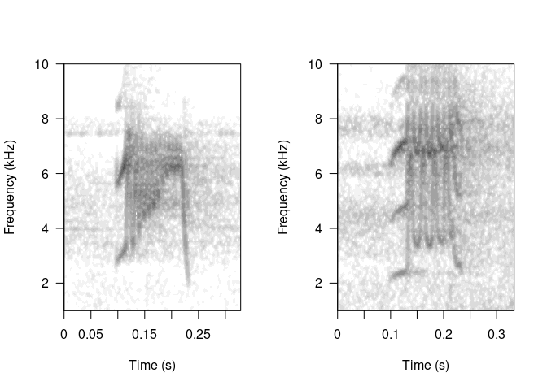
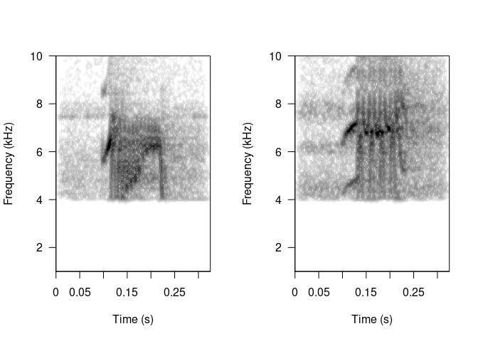
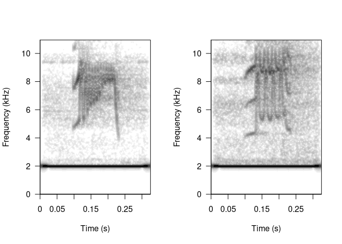

> “Is there a simple way to remove noise from the clips in an extended
> table – I can do this by directly manipulating the attributes of the
> table but it seems a bit kludgy … so again, am I missing something
> simple?”

Manipulating clips from *extended selection tables* can be pretty
straightforward. It can be done by using `lapply()` to go over each
clip. Things should be fine as long as you don’t mess with any time
related feature (i.e. the time position of the signals in the clip
remains unchanged). For example filtering out low frequencies on the
clips from the example *extended selection table* ‘lbh.est’ from the
package [NatureSounds](https://marce10.github.io/NatureSounds). This is
how the original clips look like:

``` r
# load packages
library(NatureSounds)
library(warbleR)
library(seewave)

# load data
data("lbh.est")

# extract 2 clips
w1 <- read_wave(lbh.est, 12, from = 0, to = Inf)
w2 <- read_wave(lbh.est, 20, from = 0, to = Inf)

# split graphic device
par(mfrow = c(1, 2))

# plot spectros
spectro(w1, wl = 300, ovlp = 95, flim = c(1, 10), scale = FALSE, 
        grid = FALSE, palette = reverse.gray.colors.1, 
        collevels = seq(-70, 0, 5))

spectro(w2, wl = 300, ovlp = 95, flim = c(1, 10), scale = FALSE, 
        grid = FALSE, palette = reverse.gray.colors.1, 
        collevels = seq(-70, 0, 5))
```



Clips are stored in an attribute call ‘wave.objects’. In this particular
example the list of clips can be called like this:
`attributes(lbh.est)$wave.objects`.

We can apply a bandpass filter from 4 to 10 kHz over each element of
this list using `lapply()` and `ffilter()` (from
[seewave](http://rug.mnhn.fr/seewave)):

``` r
# filter out freqs below 4 kHz
attributes(lbh.est)$wave.objects <- lapply(attributes(lbh.est)$wave.objects, 
    FUN = ffilter, from = 4000, to = 10000, output = "Wave")
```

We can double-check that the bandpass actually worked by looking again
at the spectrograms:

``` r
# extract the same 2 clips again
w1 <- read_wave(lbh.est, 12, from = 0, to = Inf)
w2 <- read_wave(lbh.est, 20, from = 0, to = Inf)

# split graphic device
par(mfrow = c(1, 2))

# plot spectros
spectro(w1, wl = 300, ovlp = 95, flim = c(1, 10), scale = FALSE, 
        grid = FALSE, palette = reverse.gray.colors.1, 
        collevels = seq(-70, 0, 5))

spectro(w2, wl = 300, ovlp = 95, flim = c(1, 10), scale = FALSE, 
        grid = FALSE, palette = reverse.gray.colors.1, 
        collevels = seq(-70, 0, 5))
```



So any [seewave](http://rug.mnhn.fr/seewave) function that works on
‘wave’ objects and returns ‘wave’ objects as well, can be used. For
instance, applying a linear frequency shift to increase pitch in 2 kHz:

``` r
# load data
data("lbh.est")

# filter out freqs below 4 kHz
attributes(lbh.est)$wave.objects <- lapply(attributes(lbh.est)$wave.objects, 
    FUN = lfs, shift = 2000, output = "Wave")

# extract the same 2 clips again
w1 <- read_wave(lbh.est, 12, from = 0, to = Inf)
w2 <- read_wave(lbh.est, 20, from = 0, to = Inf)

# split graphic device
par(mfrow = c(1, 2))

# plot spectros
spectro(w1, wl = 300, ovlp = 95, scale = FALSE, 
        grid = FALSE, palette = reverse.gray.colors.1, 
        collevels = seq(-70, 0, 5))

spectro(w2, wl = 300, ovlp = 95, scale = FALSE, 
        grid = FALSE, palette = reverse.gray.colors.1, 
        collevels = seq(-70, 0, 5))
```



Again, this should be OK as long as you don’t modify any time related
feature. If temporal features change then the time annotations are no
longer useful.

------------------------------------------------------------------------

<font size="4">Session information</font>

    ## R version 4.1.0 (2021-05-18)
    ## Platform: x86_64-pc-linux-gnu (64-bit)
    ## Running under: Ubuntu 20.04.2 LTS
    ## 
    ## Matrix products: default
    ## BLAS:   /usr/lib/x86_64-linux-gnu/atlas/libblas.so.3.10.3
    ## LAPACK: /usr/lib/x86_64-linux-gnu/atlas/liblapack.so.3.10.3
    ## 
    ## locale:
    ##  [1] LC_CTYPE=pt_BR.UTF-8       LC_NUMERIC=C              
    ##  [3] LC_TIME=es_CR.UTF-8        LC_COLLATE=pt_BR.UTF-8    
    ##  [5] LC_MONETARY=es_CR.UTF-8    LC_MESSAGES=pt_BR.UTF-8   
    ##  [7] LC_PAPER=es_CR.UTF-8       LC_NAME=C                 
    ##  [9] LC_ADDRESS=C               LC_TELEPHONE=C            
    ## [11] LC_MEASUREMENT=es_CR.UTF-8 LC_IDENTIFICATION=C       
    ## 
    ## attached base packages:
    ## [1] stats     graphics  grDevices utils     datasets  methods   base     
    ## 
    ## other attached packages:
    ## [1] warbleR_1.1.28     seewave_2.2.0      tuneR_1.4.1        NatureSounds_1.0.4
    ## [5] knitr_1.42        
    ## 
    ## loaded via a namespace (and not attached):
    ##  [1] Rcpp_1.0.9      dtw_1.23-1      fftw_1.0-7      digest_0.6.31  
    ##  [5] bitops_1.0-7    MASS_7.3-54     signal_0.7-7    evaluate_0.20  
    ##  [9] highr_0.10      pbapply_1.6-0   rlang_1.0.6     cli_3.6.0      
    ## [13] rstudioapi_0.14 rmarkdown_2.20  rjson_0.2.21    tools_4.1.0    
    ## [17] RCurl_1.98-1.9  proxy_0.4-27    parallel_4.1.0  xfun_0.36      
    ## [21] yaml_2.3.7      fastmap_1.1.0   compiler_4.1.0  htmltools_0.5.4
